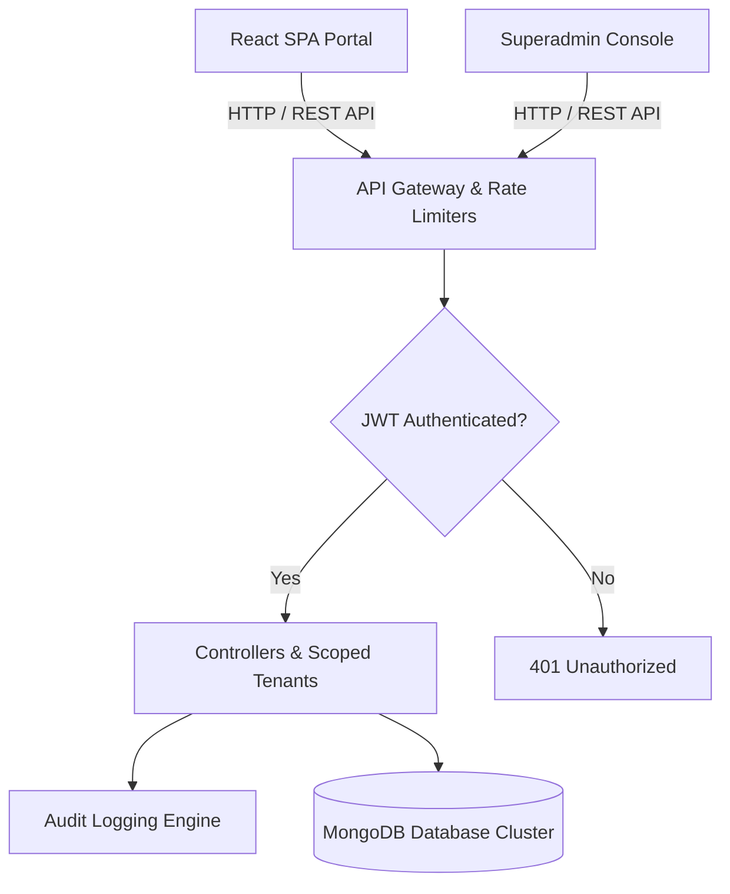

# 🌟 Nini HR — Premium Attendance & Leave Management System

A modern, high-fidelity, and feature-rich HR Management Platform designed to streamline employee check-ins, dynamic leave approval workflows, global audit logging, and team announcements with enterprise-grade data isolation.

Nini HR is architected as a **fully integrated multi-tenant client-server application** powered by a Node.js/Express REST API, MongoDB database cluster, multi-tenant workspace division, and a decoupled Superadmin diagnostic console.

---

## 🚀 Key Features & Architecture



### 🔐 Authentication & Dynamic RBAC (Multi-Tenant)
Nini HR features an active role-based routing engine (`ProtectedRoute`) and strict company-based data isolation:
- **Superadmin Console**: Decoupled standalone dashboard for cross-tenant database monitoring, security analysis, and centralized server diagnostic logs.
- **HR & Administrative Portal**: High-impact analytics suite showing company-wide attendance ratios, interactive leave workflows, employee lifecycle management, payroll calculation runs, and announcements.
- **Employee Staff Portal**: Personalized self-service area featuring real-time clock-in/out toggles, leave balance transparency trackers, custom leave request workflows, and instant bulletin updates.

### 🌴 Dynamic Leave Workflows
- **Validation Engine**: Interactive leave scheduler that checks requested days, ensures zero overlaps, verifies remaining balances, and prevents negative quotas.
- **Dynamic Identity Integration**: Form submissions automatically inherit the authenticated employee's profile ID and remain locked to their tenant group.
- **Direct Approval Routing**: Approved requests immediately adjust the employee's respective leave balance and dispatch custom events to the database.

### 🔒 Enterprise-Grade Security Hardening & Isolation
- **Strict Recipient-Scoped Privacy**: System notifications are rigorously partitioned and linked directly to distinct users (`recipient` reference) to ensure zero cross-role or cross-tenant telemetry leaks.
- **Onboarding Cryptography**: Large-scale batch additions hash user credentials instantly using `bcryptjs` with cryptographically secure salts, preventing plain-text leak vulnerabilities.
- **ReDoS Prevention**: Enhanced server input sanitizers validate and process employee records, fully shielding the regex parser from ReDoS (Regular Expression Denial of Service) exploits.
- **Strict Tenant Boundaries**: Cross-origin requests, payroll lookups, and details modifications are strictly locked under the authenticated workspace identity, preventing horizontal data escalation.

### 📋 Database Audit Trails & Telemetry Logs
- **System Telemetry Engine**: Automatic event generation capturing user interactions (`attendance_in`, `attendance_out`, `leave_request`, `leave_review`, `profile_update`, `auth_login`, `auth_failure`, etc.) with client IP auditing.
- **Company Grouping**: Logs are strictly partitioned by tenant and indexed by timestamp for rapid query execution and easy visual representation on the Superadmin logs dashboard.

### 🛡️ API Protection & Rate Limiting Guardrails
- **Dual-Layer Rate Limiters**: Integrated `express-rate-limit` instances:
  - `globalLimiter`: Throttle general API abuse (Max 100 requests per 15 minutes).
  - `authLimiter`: Prevent brute-force password attacks on `/api/auth` endpoints (Max 20 attempts per hour).
- **Reverse Proxy Compatibility**: Configured with `trust proxy` enabled, allowing accurate client IP tracking when deployed behind load balancers, CDN firewalls, or serverless hosts (Vercel, Render, Heroku).

### ⏰ Attendance & Check-In System
- **One-Click Clocking**: Punch in/out dynamically. Real-time status tags are updated in the directory.
- **Smart Analytics**: Automated calculation of average weekly hours, attendance rates, and overtime trackers.

### 📢 Broadcast Announcements & Departments
- Create and pin high-priority announcements company-wide.
- Real-time read/unread status badges for team members.
- Full company-scoped department CRUD with validation rules and cascade updates.

### ⚡ Package & Tier Guardrails (Starter Tier)
- Enforces a strict **10-employee limit** per company/workspace.
- Validated both client-side (disables creation modal) and backend-side (blocks registrations, manual creations, and Google OAuth provision requests once capacity is reached).

---

## 🎨 Premium Design System

Nini HR features a gorgeous, bespoke UI design built from the ground up:
- **HSL Theme Engine**: Seamless manual and system-level dark mode synchronizations with native dropdown contrast optimizations.
- **Glassmorphism Panels**: Modern frosted surface overlays (`backdrop-filter`) paired with harmonious gradients.
- **Micro-Animations**: Fluid transitions using customized GSAP (GreenSock Animation Platform) viewport entries.
- **Installable PWA**: Responsive offline-ready Progressive Web App configuration.

---

## 📂 Folder Structure

```
HR-Attendance-Leave-Management/
├── client-side/               # Frontend React Application
│   ├── src/
│   │   ├── assets/            # High-resolution media, icons, and logos
│   │   ├── components/        # UI kit, page layouts, and common wrappers
│   │   ├── context/           # State context providers (Auth, Theme, Notification)
│   │   ├── hooks/             # Custom utility hooks (GSAP wrappers)
│   │   ├── pages/             # App routing screens (Dashboard, Leave, Reports, Settings)
│   │   ├── router/            # Protected and public route configs
│   │   ├── services/          # API services communicating with the backend
│   │   ├── styles/            # CSS variable tokens and animation rules
│   │   ├── utils/             # Formatters and input validators
│   │   ├── App.jsx            # Main app router wrapper
│   │   └── main.jsx           # App mounting entry point
│   ├── package.json           # Frontend dependencies
│   └── vite.config.js         # Bundler & PWA configurations
├── superadmin-side/           # Decoupled Superadmin Console Application
│   ├── src/
│   │   ├── components/        # Console specific components
│   │   ├── context/           # Authentication state context
│   │   ├── pages/             # Superadmin specific dashboard and logs viewer
│   │   ├── services/          # Log and user management API service clients
│   │   ├── App.jsx            # Console app router wrapper
│   │   └── main.jsx           # Console app mounting entry point
│   └── package.json           # Superadmin console dependencies
├── server/                    # Node.js Express Backend
│   ├── config/                # Database, Cloudinary, and middleware configs
│   ├── controllers/           # API request controllers (Auth, Leave, Attendance, Logs)
│   ├── middlewares/           # JWT, role-based, audit, and rate-limiting middlewares
│   ├── models/                # MongoDB Schema models (User, Leave, Log, Attendance, etc.)
│   ├── routes/                # Express API router definitions
│   ├── scripts/               # Seeding and database utility scripts
│   ├── server.js              # Server entry point
│   └── package.json           # Server-side dependencies
├── README.md                  # Project documentation
└── .gitignore
```

---

## 📦 Dependencies Overview

### 💻 Client-Side & Superadmin (React SPAs)

| Dependency | Version | Purpose |
| :--- | :--- | :--- |
| **`react` & `react-dom`** | `^19.0.0` | Core UI library & render engine. |
| **`react-router-dom`** | `^7.0.0` | SPA router, dynamic route matching, and guards. |
| **`@tanstack/react-query`**| `^5.0.0` | Cache management, refetch schedules, and query states. |
| **`gsap`** | `^3.12.0` | High-fidelity animations, micro-interactions, and transitions. |
| **`recharts`** | `^2.12.0` | Dynamic responsive metrics, and HR data visualizations. |
| **`react-hook-form`** | `^7.50.0` | Schema-validated forms handler. |
| **`zod`** | `^3.22.0` | Validation modeling schema. |
| **`xlsx`** | `^0.18.5` | Payroll and logs report generation (Excel exporting). |
| **`axios`** | `^1.6.0` | HTTP Client for backend endpoint communication. |
| **`lucide-react`** | `^0.350.0` | Vector SVG icon pack interface. |
| **`tailwindcss`** | `^4.0.0` | Utility-first custom design variables. |

### 🗄️ Server-Side (Node.js & Express API)

| Dependency | Version | Purpose |
| :--- | :--- | :--- |
| **`express`** | `^5.0.0` | Microservice router and web app gateway. |
| **`mongoose`** | `^8.0.0` | MongoDB object modeling framework and connection pools. |
| **`jsonwebtoken`** | `^9.0.0` | User session validation and crypto signing keys. |
| **`bcryptjs`** | `^2.4.3` | Cryptographic user credential hashing. |
| **`express-rate-limit`** | `^7.2.0` | Dual-layer API brute force throttler. |
| **`nodemailer`** | `^6.9.0` | SMTP support client for notification pipelines. |
| **`resend`** | `^3.2.0` | Enterprise cloud transaction delivery client API. |
| **`multer` & `cloudinary`** | `^2.0.0` | Employee avatar management and CDN media pipelines. |
| **`cors`** | `^2.8.5` | Cross-Origin resource management rules. |
| **`morgan`** | `^1.10.0` | Standard terminal runtime request logger. |

---

## 🚀 Quick Start & Installation

### Prerequisites
- Node.js (v18.x or higher recommended)
- A running MongoDB instance (Local community server or Atlas Cluster)
- Cloudinary developer account (for avatar uploads)

---

### 1. Server Setup

Navigate to the `server/` directory and configure the environment:
```bash
cd server
```

Create a new `server/.env` file:
```env
# General Service Settings
PORT=8000
NODE_ENV=development

# Database Setup
MONGODB_URI=mongodb+srv://<username>:<password>@cluster.mongodb.net/ninihr?retryWrites=true&w=majority

# Security Configuration
JWT_SECRET=generate_your_secure_random_hash_here

# Transactional Emailing (SMTP or Resend API)
RESEND_API_KEY=re_yourResendApiKeyHere
MAIL_FROM=Nini HR <notifications@yourcompany.com>

# Cloudinary Media Storage (Avatar Uploads)
CLOUDINARY_CLOUD_NAME=your_cloudinary_cloud_name
CLOUDINARY_API_KEY=your_cloudinary_api_key
CLOUDINARY_API_SECRET=your_cloudinary_api_secret
```

Install packages, seed database records, and run in dev mode:
```bash
npm install
npm run seed     # Triggers database seed script for structural validation
npm run dev      # Starts development nodemon file-watcher
```
The backend API will run on **`http://localhost:8000`**.

---

### 2. Client-Side Setup

Navigate to the `client-side/` directory:
```bash
cd ../client-side
```

Create a `client-side/.env` file:
```env
VITE_API_URL=http://localhost:8000/api
```

Install modules and start the dev server:
```bash
npm install
npm run dev
```
The Employee & Admin dashboard runs on **`http://localhost:5173`**.

---

### 3. Superadmin Console Setup

Navigate to the `superadmin-side/` directory:
```bash
cd ../superadmin-side
```

Create a `superadmin-side/.env` file:
```env
VITE_API_URL=http://localhost:8000/api
```

Install modules and launch:
```bash
npm install
npm run dev
```
The Superadmin console interface runs on **`http://localhost:5174`**.

---

## 📦 Build & Production

To generate fully optimized static HTML/JS/CSS assets for staging or production servers:

```bash
# Production compiles for the React SPAs
cd client-side
npm run build

cd ../superadmin-side
npm run build
```

These scripts compile the client code into a lightweight `/dist` folder with cached asset mappings, fully optimized for static web hosts (Vercel, Netlify, AWS S3).
